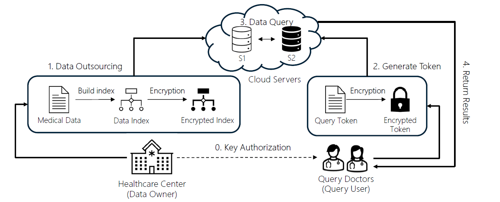

# WeightedSim

## Introduction 

This is the simulation source code for WeightedSim, a privacy-protecting data query over multidimensional data based on weighted Euclidean distance using the two-cloud-servers model.

It simulates how the data owner builds up an encrypted index and outsources it to the cloud server, as well as how these two cloud servers cooperate to return the query result to the query user.


### Overview




## Structure


### External Libraries

[Symmetric Homomorphic Encryption (SHE)](https://github.com/guojuntang/SymHomEnc): Homomorphic Encryption Library. 

[multi-RTree](https://github.com/davidmoten/rtree-multi): R-Tree Library.

[EEG data](https://archive.ics.uci.edu/ml/datasets/EEG+Eye+State): Tested dataset.

### Description of Directories/Files

encryptedrtree: The encrypted data index based on SHE and R-Tree which supports range query over the encrypted data.

entities: The entities in the scheme, including the query user and two cloud servers (one for storing the encrypted index, and the other one for data query assistance).

privacyprotocol: The privacy-preserving protocols for the encrypted data comparison between two cloud servers.

[Main.java](src/main/java/com/github/weightedsim/Main.java): A small demo for measuring the data query time.

[Simulation.java](src/main/java/com/github/weightedsim/Simulation.java): A small demo for simulating the whole process, including outsourcing the data, launching the query request, and returning the query result.


## Build and Execution

You can acquire the source code by 

```
git clone https://github.com/guojuntang/WeightedSim.git
```

You can build and execute the simulation with IntelliJ IDEA.

Or use maven

```
mvn compile
mvn exec:java -Dexec.mainClass=com.github.weightedsim.Simulation
```

## Original Paper

(TODO)